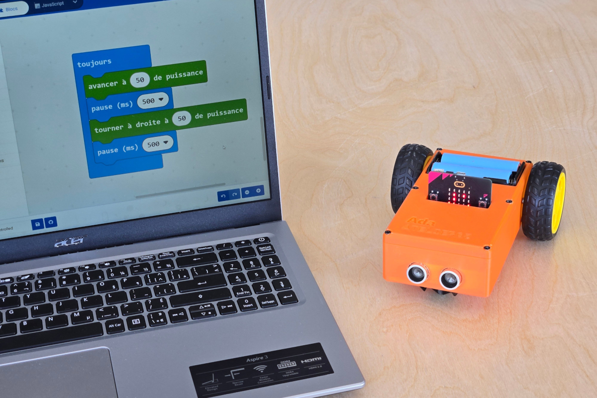

# pxt-ada

Extention for [MakeCode](https://makecode.com/) to program our robot named *Ada*.

    

This extension provides a set of blocks that can be used to control the robot's motors and ultrasound sensor.

Basic blocks are provided to control the robot's motors with an added pause delay for ease of use and intuitive programming.

    

For more control, the extension also provides a set of blocks to control the robot's motors directly.

    

Using these paired with the `pause` block, you can create more complex programs to control the robot's motors.